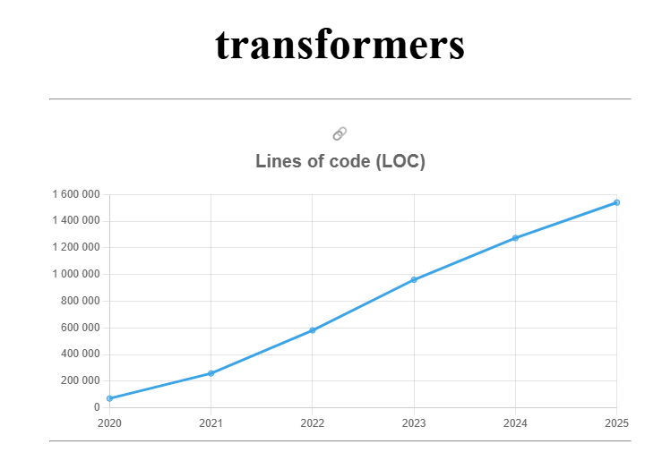

# Explorando evolução de código

Neste exercício, iremos explorar a evolução de código em sistemas reais.

Iremos utilizar a ferramenta [GitEvo](https://github.com/andrehora/gitevo).
Essa ferramenta analisa a evolução de código em repositórios Git nas seguintes linguagens: Python, JavaScript, TypeScript e Java.

Você deve submeter via Moodle apenas o link do seu `fork`, conforme descrito abaixo.

# Passo 1: Selecionar repositório a ser analisado

Selecione um repositório relevante na linguagem de sua preferência (Python, JavaScript, TypeScript ou Java).
Você pode encontrar projetos interessantes nos links abaixo:

- Python: https://github.com/topics/python?l=python
- JavaScript: https://github.com/topics/javascript?l=javascript
- TypeScript: https://github.com/topics/typescript?l=typescript
- Java: https://github.com/topics/java?l=java

# Passo 2: Instalar e rodar a ferramenta GitEvo

Instale a ferramenta [GitEvo](https://github.com/andrehora/gitevo) com o comando:

```
pip install gitevo
```

Rode a ferramenta no repositório selecionado através do seguinte comando (dependendo da linguagem do projeto que escolheu):

```shell
# Python
$ gitevo -r python <git_url>

# JavaScript
$ gitevo -r js <git_url>

# TypeScript
$ gitevo -r ts <git_url>

# Java
$ gitevo -r java <git_url>
```

Onde `<git_url>` é URL do repositório a ser analisado.
Por exemplo, para analisar o projeto Flask escrito em Python:

```
$ gitevo -r python https://github.com/pallets/flask
```

# Passo 3: Explorar os gráficos de evolução de código (`index.html`)

Ao rodar a ferramenta [GitEvo](https://github.com/andrehora/gitevo), o arquivo `index.html` é gerado com diversos gráficos de evolução de código.

Abra o arquivo `index.html` e observe com atenção os gráficos gerados.

# Passo 4: Explicar um gráfico de evolução de código

Selecione um dos gráficos de evolução e explique-o com suas palavras.
Por exemplo, você pode:

- Detalhar a evolução ao longo do tempo, 
- Detalhar se as curvas estão de acordo com boas práticas,
- Explicar grandes alterações nas curvas,
- Explorar a documentação do repositório em busca de explicações para grandes alterações
- Etc.

Seja criativo!

# Exercício

Para responder este exercício, primeiramente, você deve fazer um `fork` deste repositório.
No Moodle, você deve submeter apenas a URL do seu `fork`.

Em seguida, adicione o arquivo gerado `index.html` no seu fork.

Por fim, responda as questões abaixo no seu `fork`: 

1. Repositório selecionado: https://github.com/huggingface/transformers

2. Gráfico selecionado: Lines of code (LOC)



3. Explicação:


O gráfico mostra que o repositorio do transformers teve uma evolução constante, não brusca, como podemos ver em muitos repositórios relacionados com Inteligência Artifical que nos últimos anos tiveram uma evolução muito rápida. Em 2020, o repositório tinha cerca de 70 mil linhas e em 2025, o repositório tem 1.54 milhão de linhas de código. Apesar de não ter uma subida repentina no LOC, mas vemos que ano a ano, a média de LOC foi de 300 mil.

O gráfico evidencia a evolução constante no número de linhas de código (LOC) do repositório transformers. Em 2020, o projeto contava com aproximadamente 70 mil linhas de código e esse número cresceu progressivamente até atingir cerca de 1,54 milhão em 2025. Esse crescimento não apresenta saltos nem quedas, o que sugere uma evolução sustentável do código. Diferentemente de outros repositórios relacionados à área de inteligência artificial, que frequentemente registram aumentos repentinos de LOC em curtos períodos, o que pode indicar acúmulo desorganizado de funcionalidades, o transformers apresenta um acréscimo médio anual de cerca de 300 mil linhas.

E ao verificar a documentação oficial e os changelogs disponíveis no repositório do transformers, é possível perceber que os aumentos mais acentuados nos anos de 2021 e 2022 coincidem com a inclusão de novos modelos pré-treinados e ampliação do suporte a múltiplos frameworks (como TensorFlow e PyTorch). O crescimento contínuo entre 2023 e 2025 acompanha a novos recursos como a integração com ferramentas como PEFT, exportação para ONNX e melhorias relacionadas a escalabilidade e inferência com grandes modelos de linguagem. Esses fatores justificam o aumento das linhas de código.